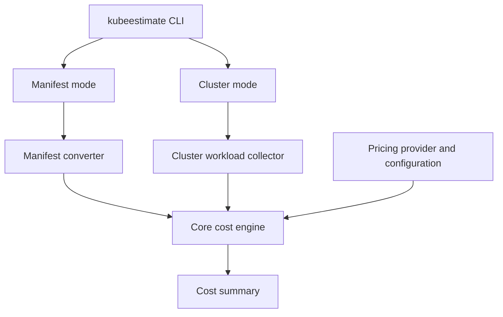

# KubeBudget

KubeBudget is a Kubernetes cost-estimation project built in Go.

The project currently focuses on a reusable cost engine that estimates how much a Kubernetes workload will cost. Integrations such as a CLI plugin, GitHub Actions, and a Kubernetes admission webhook are future consumers of the engine.

The current MVP is intentionally narrow: build and test the cost estimation core in Go.

## Why this project

This project is a strong fit for a cloud/platform engineering portfolio because it combines:
- Kubernetes workload understanding
- Go development for tooling and controllers
- cost modeling and FinOps concepts
- developer-facing CLI UX
- GitOps and CI/CD awareness
- future platform enforcement patterns

## Product direction

The project will eventually be organized around several components, but only the core is being implemented now:

1. Core Engine
   - the real cost estimation logic
   - receives workload inputs and pricing rules
   - returns cost estimate and delta information

2. Future integrations
   - kubectl-style or standalone command
   - GitHub Action PR check
   - Kubernetes admission webhook

## Architecture

KubeBudget is built around a reusable cost engine. The `kubeestimate` CLI is the entry point and supports two estimation modes: manifest-based estimation and cluster-based estimation. Both modes normalize workload data before sending it to the same cost engine.



- **Core engine** ? accepts a normalized workload model and calculates cost; it does not parse Kubernetes YAML or call the Kubernetes API.
- **Manifest converter** ? converts raw manifests into the core's normalized model.
- **Cluster workload collector** ? queries the Kubernetes API and converts selected live workloads into the same normalized model.
- **CLI** ? developer-facing entry point that selects a mode and prints cost summaries.
- **GitHub Action PR check** ? CI-level validation that publishes cost deltas on pull requests.
- **Admission webhook** ? cluster-native enforcement, planned as a later step.

See [docs/architecture.md](docs/architecture.md) for full responsibilities, priority order, and MVP scope per component.

## Tech stack

- Go
- Kubernetes manifests and resource model
- YAML parsing for workload evaluation
- Future integration tooling

## Repository structure

The project is organized around a Go core and lightweight integrations:

```text
kube-budget/
??? cmd/
?   ??? kube-budget/
??? core/
?   ??? engine/
?   ??? pricing/
?   ??? providers/
?       ??? aws/
??? docs/
??? go.mod
??? README.md
??? LICENSE
```

## Project status

Early MVP in active development.

The project is focused on building a useful Kubernetes cost-estimation tool that can evolve into a stronger platform-facing solution.

## CLI

Install the Linux command from the repository root:

```sh
go install ./cmd/kubeestimate
```

Add Go's binary directory to your Bash `PATH`, then restart the shell (or run `source ~/.bashrc`):

```sh
echo 'export PATH="$PATH:$(go env GOPATH)/bin"' >> ~/.bashrc
source ~/.bashrc
```

Then estimate a Deployment manifest:

```sh
kubeestimate deployment.yaml --provider aws --region eu-west-1
```

For a quick estimate, provide only the manifest. The CLI uses AWS, `us-east-1`, and `m6i.large` on-demand pricing, and prints an advisory for each assumed value:

```sh
kubeestimate deployment.yaml
```

Use `--instance-type` when the cluster uses a different worker-node type; it defaults to `m6i.large`:

```sh
kubeestimate deployment.yaml --provider aws --region eu-west-1 --instance-type c6i.large
```

The CLI reads CPU, memory, and ephemeral-storage requests from the manifest. It currently supports Deployment manifests and illustrative pricing snapshots for AWS (`us-east-1`, `eu-west-1`), Azure (`eastus`, `westeurope`), and GCP (`us-central1`, `europe-west1`). AWS uses EC2 instance types such as `m6i.large`; Azure uses VM sizes such as `Standard_D2s_v5`; GCP uses Compute Engine machine types such as `e2-standard-2`. The selected worker type is used to derive the cost attributed to requested resources. Output includes hourly and daily USD estimates; the daily total is the hourly total multiplied by 24. AWS region identifiers use hyphens, so use `eu-west-1` rather than `eu-west1`.

Estimate a GKE workload with GCP pricing:

```sh
kubeestimate deployment.yaml --provider gcp --region us-central1 --instance-type e2-standard-2
```

For a GCP quick estimate, omit the region and machine type to use `us-central1` and `e2-standard-2`.

Estimate an AKS workload with Azure pricing:

```sh
kubeestimate deployment.yaml --provider azure --region eastus --instance-type Standard_D2s_v5
```

For an Azure quick estimate, omit the region and machine type to use `eastus` and `Standard_D2s_v5`.

## Local dashboard

The first dashboard is a React and TypeScript frontend embedded in a Wails desktop application. It accepts one Deployment manifest through file selection, drag and drop, or pasted YAML and displays its hourly, daily, and monthly requested cost. The generated Wails bridge calls the Go manifest adapter, which delegates estimation to the same Manifest Mode application service used by other entry points.

Install the Wails CLI and frontend dependencies:

```sh
go install github.com/wailsapp/wails/v2/cmd/wails@v2.15.0
cd frontend && npm install && cd ..
```

On Ubuntu, install the native desktop dependencies. Ubuntu 24.04 and newer use WebKitGTK 4.1:

```sh
sudo apt install libgtk-3-dev libwebkit2gtk-4.1-dev pkg-config
```

Start the desktop dashboard from the repository root:

```sh
wails dev -tags webkit2_41
```

Use `wails dev` without the tag on systems that provide WebKitGTK 4.0. To work on the visual frontend without launching the desktop shell, run `npm run dev` from `frontend`; cost estimation is only available when the page runs inside Wails.

### Amazon EKS connection MVP

The dashboard supports EKS through the local AWS CLI and kubeconfig `exec` authentication. It does not collect or store AWS access keys, secret keys, or Kubernetes bearer tokens.

Prerequisites:

- AWS CLI v2 installed and available to the desktop application's `PATH`
- An authenticated AWS session, for example `aws sso login --profile company-dev`
- An IAM principal with `eks:DescribeCluster`
- Kubernetes access to the cluster through an EKS access entry or Kubernetes RBAC

In the cluster connection dialog, choose **Amazon EKS**, enter the cluster name and region, and optionally provide an AWS profile or role ARN. KubeBudget runs `aws eks update-kubeconfig`, creates an `eks/<cluster>/<region>` context, and then validates that context through the Kubernetes API. Private EKS endpoints still require local VPN or network access to the VPC.


## Roadmap

- [x] Create the repository skeleton
- [x] Create the initial cost estimation core in Go with support for AWS ( basic prices)
- [x] Add a converter with support for Kubernetes manifest ( Only Deployment kind)
- [x] Implement a CLI plugin support.
- [x] Implement first Wails adapter for UI
- [x] Implement first dashboard (only manifest mode, one yaml)
- [x] Add cost estimation support for GCP
- [x] Add cost estimation support for Azure
- [x] Add multi-cloud/provider pricing comparisong using a toogler in cost estimation section.
- [x] Store log and show logs of the previous simulations
- [x] Implement log old estimations.
- [x] Implement connection to a real cluster
- [x] First responsabilities of cluster management approach...
- [x] Enhance Overview cluster section.
- [x] Enhance Workloads cluster section.
- [x] Enhance Namespaces cluster section.
- [x] Enhance resource cluster section.
- [x] Enhance Nodes cluster section.
- [x] Add live YAML workload inspection.
- [x] Add cluster connection for Providers (EKS oriented)
- [x] Add monitoring data support for EKS ( AWS Elastic Kubernetes Service )
- [x] Create change-states local simulator
- [x] Add cost explorer section in Cost Section
- [x] Add Budget & forecast section in Cost section.
- [x] Add optimization section in Cost Section.
- [x] Create enhanced eks cluster to check cost optimization functionality
- [ ] Enhance Manifest section
- [ ] Add enhanced estimation in manifest mode when cluster from provider is linked.
...
...
- [ ] Add Kubernetes admission webhook support
- [ ] Add support to be used in kubectl.
- [ ] Add a GitHub Action that compares cost deltas in PRs
...
- [ ] Add FINAL documentation - design - showcase...
- [ ] Add explanation of possible future evolving (cluster persistent information, analyzis behaviour, google cluster support, azure cluster support,llm for predict costs...)

