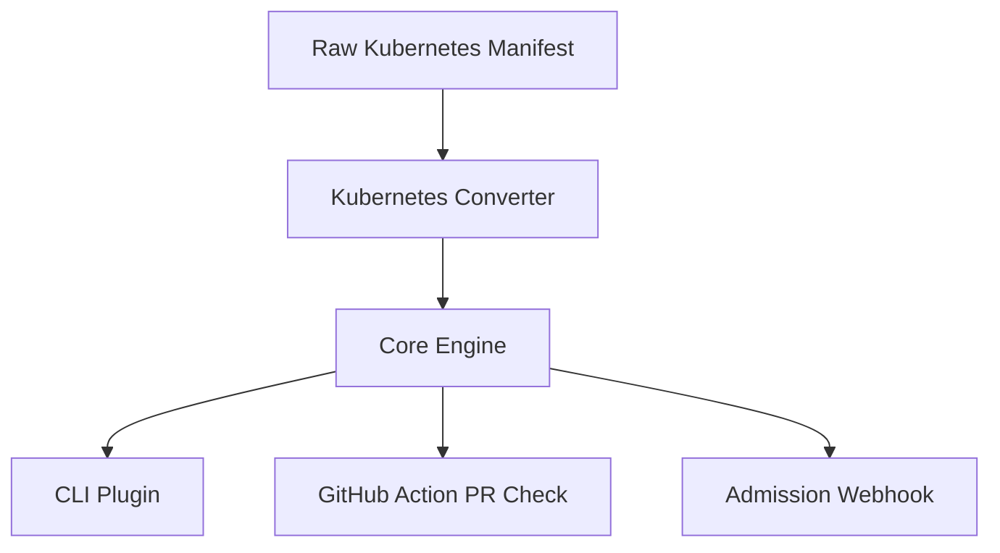

# KubeBudget

KubeBudget is a Kubernetes cost-estimation project built in Go.

The project currently focuses on a reusable cost engine that estimates how much a Kubernetes workload will cost. Integrations such as a CLI plugin, GitHub Actions, and a Kubernetes admission webhook are future consumers of the engine.

The current MVP is intentionally narrow: build and test the cost estimation core in Go.

## Why this project

This project is a strong fit for a cloud/platform engineering portfolio because it combines:
- Kubernetes workload understanding
- Go development for tooling and controllers
- cost modeling and FinOps concepts
- developer-facing CLI UX
- GitOps and CI/CD awareness
- future platform enforcement patterns

## Product direction

The project will eventually be organized around several components, but only the core is being implemented now:

1. Core Engine
   - the real cost estimation logic
   - receives workload inputs and pricing rules
   - returns cost estimate and delta information

2. Future integrations
   - kubectl-style or standalone command
   - GitHub Action PR check
   - Kubernetes admission webhook

## Architecture

KubeBudget is built around a reusable cost engine that estimates the cost of Kubernetes workloads. The engine is exposed through multiple interfaces, but the current MVP focuses on four main layers: Core engine, CLI plugin, GitHub Actions PR check, and Admission webhook.



- **Core engine** ? accepts a normalized workload model and calculates cost; does not parse Kubernetes YAML.
- **Kubernetes converter** ? the boundary between raw manifests and the core's normalized model.
- **CLI plugin** ? developer-facing entry point that calls the core and prints cost summaries.
- **GitHub Action PR check** ? CI-level validation that publishes cost deltas on pull requests.
- **Admission webhook** ? cluster-native enforcement, planned as a later step.

See [docs/architecture.md](docs/architecture.md) for full responsibilities, priority order, and MVP scope per component.

## Tech stack

- Go
- Kubernetes manifests and resource model
- YAML parsing for workload evaluation
- Future integration tooling

## Repository structure

The project is organized around a Go core and lightweight integrations:

```text
kube-budget/
??? cmd/
?   ??? kube-budget/
??? core/
?   ??? engine/
?   ??? pricing/
?   ??? providers/
?       ??? aws/
??? docs/
??? go.mod
??? README.md
??? LICENSE
```

## Project status

Early MVP in active development.

The project is focused on building a useful Kubernetes cost-estimation tool that can evolve into a stronger platform-facing solution.


## Roadmap

- [x] Create the repository skeleton
- [x] Create the initial cost estimation core in Go with support for AWS ( basic prices)
- [x] Add a converter with support for Kubernetes manifest ( Only Deployment kind)
- [ ] Implement a CLI plugin similar to kcost
- [ ] Add support to be used in kubectl.
- [ ] Add a GitHub Action that compares cost deltas in PRs
- [ ] Add Kubernetes admission webhook support
- [ ] Improve pricing accuracy and configuration
- [ ] Add more workload types and resource coverage
- [ ] Add support for GCP
- [ ] Add support for Azure
- [ ] Improve manifest converter ( Support more types of manifests)

