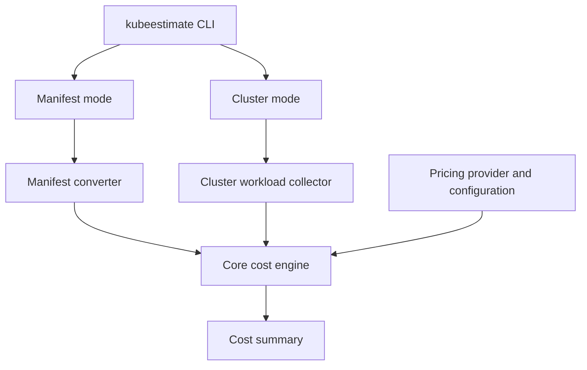

# KubeBudget

KubeBudget is a Kubernetes cost-estimation project built in Go.

The project currently focuses on a reusable cost engine that estimates how much a Kubernetes workload will cost. Integrations such as a CLI plugin, GitHub Actions, and a Kubernetes admission webhook are future consumers of the engine.

The current MVP is intentionally narrow: build and test the cost estimation core in Go.

## Why this project

This project is a strong fit for a cloud/platform engineering portfolio because it combines:
- Kubernetes workload understanding
- Go development for tooling and controllers
- cost modeling and FinOps concepts
- developer-facing CLI UX
- GitOps and CI/CD awareness
- future platform enforcement patterns

## Product direction

The project will eventually be organized around several components, but only the core is being implemented now:

1. Core Engine
   - the real cost estimation logic
   - receives workload inputs and pricing rules
   - returns cost estimate and delta information

2. Future integrations
   - kubectl-style or standalone command
   - GitHub Action PR check
   - Kubernetes admission webhook

## Architecture

KubeBudget is built around a reusable cost engine. The `kubeestimate` CLI is the entry point and supports two estimation modes: manifest-based estimation and cluster-based estimation. Both modes normalize workload data before sending it to the same cost engine.



- **Core engine** ? accepts a normalized workload model and calculates cost; it does not parse Kubernetes YAML or call the Kubernetes API.
- **Manifest converter** ? converts raw manifests into the core's normalized model.
- **Cluster workload collector** ? queries the Kubernetes API and converts selected live workloads into the same normalized model.
- **CLI** ? developer-facing entry point that selects a mode and prints cost summaries.
- **GitHub Action PR check** ? CI-level validation that publishes cost deltas on pull requests.
- **Admission webhook** ? cluster-native enforcement, planned as a later step.

See [docs/architecture.md](docs/architecture.md) for full responsibilities, priority order, and MVP scope per component.

## Tech stack

- Go
- Kubernetes manifests and resource model
- YAML parsing for workload evaluation
- Future integration tooling

## Repository structure

The project is organized around a Go core and lightweight integrations:

```text
kube-budget/
??? cmd/
?   ??? kube-budget/
??? core/
?   ??? engine/
?   ??? pricing/
?   ??? providers/
?       ??? aws/
??? docs/
??? go.mod
??? README.md
??? LICENSE
```

## Project status

Early MVP in active development.

The project is focused on building a useful Kubernetes cost-estimation tool that can evolve into a stronger platform-facing solution.

## CLI

Install the Linux command from the repository root:

```sh
go install ./cmd/kubeestimate
```

Add Go's binary directory to your Bash `PATH`, then restart the shell (or run `source ~/.bashrc`):

```sh
echo 'export PATH="$PATH:$(go env GOPATH)/bin"' >> ~/.bashrc
source ~/.bashrc
```

Then estimate a Deployment manifest:

```sh
kubeestimate deployment.yaml --provider aws --region eu-west-1
```

For a quick estimate, provide only the manifest. The CLI uses AWS, `us-east-1`, and `m6i.large` on-demand pricing, and prints an advisory for each assumed value:

```sh
kubeestimate deployment.yaml
```

Use `--instance-type` when the cluster uses a different worker-node type; it defaults to `m6i.large`:

```sh
kubeestimate deployment.yaml --provider aws --region eu-west-1 --instance-type c6i.large
```

The CLI reads CPU, memory, and ephemeral-storage requests from the manifest. It currently supports Deployment manifests and illustrative AWS pricing snapshots for `us-east-1` and `eu-west-1`. The node type is used to derive the cost attributed to those requested resources. Output includes hourly and daily USD estimates; the daily total is the hourly total multiplied by 24. AWS region identifiers use hyphens, so use `eu-west-1` rather than `eu-west1`.


## Roadmap

- [x] Create the repository skeleton
- [x] Create the initial cost estimation core in Go with support for AWS ( basic prices)
- [x] Add a converter with support for Kubernetes manifest ( Only Deployment kind)
- [x] Implement a CLI plugin support.
- [ ] Implement firest Wails adapter for UI
- [ ] Implement first dashboard (only manifest mode, one yaml)
- [ ] Improve dashboard to support múltiples yamls.
- [ ] Add a GitHub Action that compares cost deltas in PRs
- [ ] Add Kubernetes admission webhook support
- [ ] Improve pricing accuracy and configuration
- [ ] Add more workload types and resource coverage
- [ ] Add support for GCP
- [ ] Add support for Azure
- [ ] Add support to be used in kubectl.
- [ ] Add a GitHub Action that compares cost deltas in PRs
- [ ] Improve manifest converter ( Support more types of manifests)
- []

