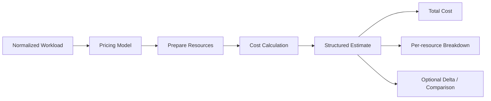

# Core Engine

This directory contains the core logic for KubeBudget.

The purpose of the core is to keep the cost estimation logic independent from CLI, GitHub Actions, and Kubernetes-specific input parsing. In other words, the core should answer one question clearly:

> Given a workload definition and a pricing model, what is the estimated cost?

## Design goals

- Keep the engine reusable across multiple entry points
- Keep pricing logic separate from delivery logic
- Make it easy to test the estimator in isolation
- Keep the model simple enough for an MVP but extensible later

## Boundary

The core receives normalized data. A separate Kubernetes converter parses the raw manifest before calling the core:

```text
Raw Kubernetes manifest -> Kubernetes converter -> core.Workload -> cost engine
```

The core must not depend on Kubernetes YAML structure or on the component that delivered the input. See [core-contract.md](../docs/core-contract.md) for the core data contract and [layer-contracts.md](../docs/layer-contracts.md) for the boundaries between components.

## High-level architecture



## Main responsibilities

### 1. Workload input
The engine should accept a normalized representation of a workload, such as:
- CPU requests
- memory requests
- storage requests
- resource names
- optional namespace or environment metadata

### 2. Pricing model
The engine should use a simple pricing model for the MVP, for example:
- CPU cost per core
- memory cost per GB
- storage cost per GB

This can later be replaced or extended with:
- provider-specific pricing
- namespace budgets
- region-aware pricing
- discount policies

### 3. Cost calculation
The engine calculates:
- total cost
- per-resource cost
- maybe delta against a previous estimate or baseline

### 4. Output contract
The output should be a stable, structured result so that every integration can reuse it. For example:

```go
Estimate{
  Total: 12.5,
  PerResource: map[string]float64{
    "api": 8.0,
    "redis": 4.5,
  },
  Currency: "USD",
}
```

## Current MVP scope

At this stage, the core intentionally stays simple:
- workload resources only
- basic price model
- total estimation output
- per-resource breakdown

This is enough to support the CLI and later GitHub Actions integration without coupling the engine to the platform entry points.
