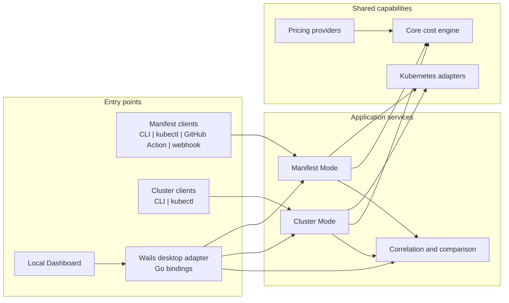
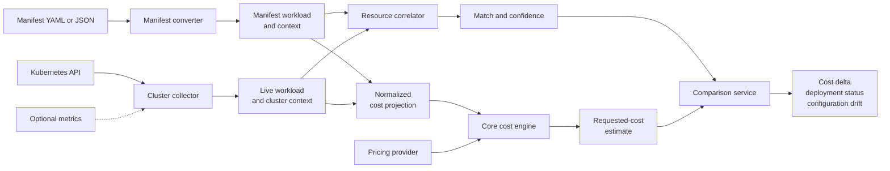

# KubeBudget Architecture

This document describes the target architecture and expanded product scope for KubeBudget. It distinguishes the reusable estimation behavior from the ways users and automation invoke it.

KubeBudget has two principal estimation workflows:

- **Manifest Mode** estimates the requested cost of Kubernetes manifests before or independently of deployment.
- **Cluster Mode** inspects workloads in a linked Kubernetes cluster and estimates their requested cost while retaining live cluster context.

Both modes project their source data into the same small cost model and use the same core cost engine. They do not otherwise share a complete data model: Cluster Mode retains information that cannot exist in a manifest, such as resource UIDs, status, ownership, placement, and observed usage.

## Architectural principles

1. Entry points contain delivery and presentation behavior, not estimation rules.
2. Manifest Mode and Cluster Mode implement reusable application workflows.
3. Kubernetes-specific parsing and API access remain outside the core engine.
4. The shared normalized model contains only the data required to calculate requested cost.
5. Source-specific context is preserved outside that normalized cost model.
6. Correlation reports uncertainty instead of presenting probable matches as facts.
7. Requested-cost estimation and utilization-based cost analysis are separate capabilities.

## Target architecture maps

### System overview

The overview groups entry points by the application workflows they can invoke. The detailed capability matrix later in this document lists each entry point separately.



### Estimation and comparison flow

This view shows how rich source-specific models share a small cost projection without losing manifest or cluster context.



## Layers and ownership

### 1. Entry points

Entry points adapt a particular environment to the application services. They may read files, parse command-line flags, receive HTTP requests, publish pull request comments, or format responses. They must not duplicate conversion, pricing, correlation, or estimation rules.

#### Standalone CLI

The CLI provides direct access to Manifest Mode and Cluster Mode. It owns command selection, flags, file access, terminal output, and process exit codes.

#### kubectl plugin

The plugin provides Kubernetes-oriented commands using the user's current kubeconfig and context. It may expose manifest estimation, cluster inspection, and planned-versus-live comparison while delegating those workflows to the application services.

#### GitHub Action PR check

The action estimates manifests from the base and candidate revisions, calculates their cost delta, publishes a pull request summary, and optionally enforces a configured threshold. It normally uses Manifest Mode and does not require cluster access.

#### Admission webhook

The webhook receives a Kubernetes admission request, delegates estimation to Manifest Mode, applies a separate policy decision, and returns an allow or deny response. Admission policy belongs to the webhook integration or a dedicated policy service, not to the cost engine.

#### Local Dashboard

The dashboard is a local estimation and management interface built as a Wails desktop application with a web frontend. Wails Go bindings expose a thin desktop adapter to the frontend. The adapter translates UI requests and delegates them to the application services; it does not implement estimation behavior.

This approach permits a rich React and TypeScript interface without requiring a local HTTP API. The application services remain independent of Wails so an HTTP adapter can be added later for remote or multi-user access.

The initial dashboard workflows are:

- select or drag and drop one manifest file
- display resource requests and their estimated cost
- link a cluster using local Kubernetes credentials
- inspect estimated costs for live workloads
- determine whether an uploaded workload is probably deployed
- compare planned and live resource requests and costs

Manifest ingestion should expand progressively:

1. The first version estimates one YAML or JSON file at a time.
2. A later version accepts multiple files, folders, and multi-document YAML.
3. Related documents can be stored as a named manifest set, such as `checkout-production`.

The application contract should accept a document collection from the beginning even while the first UI submits one document. This avoids coupling Manifest Mode to a file picker or single-file workflow.

```go
type ManifestInput struct {
	Documents []ManifestDocument
}
```

The dashboard should present parsed Kubernetes information as the primary view rather than showing raw YAML first. Its principal views are:

- **Manifest workspace:** a searchable table of workloads, kind, namespace, replicas, estimated cost, and validation status
- **Workload details:** overview, resources, cost breakdown, source YAML, and live-comparison tabs
- **Live comparison:** planned and live values side by side, including cost delta, deployment state, drift, and match confidence

Related resources are grouped by Kubernetes identity: API group, kind, namespace, and name. Objects such as a Deployment and its HorizontalPodAutoscaler can appear under the same logical workload. Non-costed objects such as Services and ConfigMaps may remain visible as contextual resources.

The term **Dashboard** is preferred over **monitoring UI** for the initial scope. Continuous collection, historical metrics, and alerting are not implied until they are explicitly added.

### 2. Application services

Application services coordinate complete use cases and are reusable from every compatible entry point.

Each service exposes its own transport-independent contract. Compatibility means that different entry-point adapters can call the same contract, not that Manifest Mode, Cluster Mode, and comparison must share one interface.

```go
type ManifestEstimator interface {
	EstimateManifest(ctx context.Context, input ManifestInput) (ManifestResult, error)
}

type ClusterEstimator interface {
	EstimateCluster(ctx context.Context, input ClusterInput) (ClusterResult, error)
}

type WorkloadComparator interface {
	Compare(ctx context.Context, planned ManifestResult, live ClusterResult) (ComparisonResult, error)
}
```

These are target architectural contracts rather than the exact current Go API. CLI flags, Wails values, HTTP requests, GitHub payloads, and admission requests are translated by their adapters before reaching these interfaces.

#### Manifest Mode

Manifest Mode:

- accepts one manifest document or a defined collection of related documents
- invokes the manifest converter
- validates that the resulting workload can be estimated
- creates the normalized cost projection
- invokes the core engine
- returns a structured estimate with manifest context and diagnostics

It does not know whether its caller is the CLI, dashboard, GitHub Action, or admission webhook.

#### Cluster Mode

Cluster Mode:

- connects to a Kubernetes API using an explicitly selected context
- discovers supported workloads within the permitted scope
- collects resource requests and live Kubernetes metadata
- creates the same normalized cost projection used by Manifest Mode
- invokes the core engine for requested-cost estimates
- retains cluster-only context for inspection, correlation, and comparison

Cluster Mode must define connection timeouts, permissions, namespace scope, and behavior for inaccessible or unsupported resources. Linking a cluster means configuring this access; it must not silently change the active Kubernetes context.

#### Resource correlator

The correlator links an uploaded manifest workload to its probable live resource. This is a separate capability because matching may be incomplete or ambiguous.

Candidate matching signals include:

- API group, kind, namespace, and name
- Kubernetes owner references
- labels and annotations
- Helm release metadata
- Argo CD or Flux metadata
- an explicit KubeBudget annotation containing source repository and manifest identity

Kubernetes UIDs identify live objects but cannot independently match a pre-deployment manifest because the UID is assigned by the cluster. Correlation results therefore include a confidence level and reasons for the match.

#### Comparison service

The comparison service combines a manifest estimate, a live estimate, and an optional correlation result. It can report:

- planned requested cost
- live requested cost
- absolute and percentage cost delta
- deployed, not deployed, ambiguous, or unknown status
- replica and resource-request drift
- correlation confidence and matching evidence

A linked cluster enriches a manifest estimate; it does not rewrite the original estimate. The planned result remains reproducible from the uploaded manifest, while live information is presented as a separate comparison.

### 3. Kubernetes adapters

#### Manifest converter

The converter parses Kubernetes YAML or JSON, validates supported kinds, resolves related documents such as autoscalers when provided, converts Kubernetes quantities, and produces manifest workload context. It contains no pricing rules.

#### Cluster workload collector

The collector queries the Kubernetes API, selects supported live workloads, and captures both their cost-relevant requests and cluster-only context. It owns Kubernetes API translation but does not calculate cost.

### 4. Shared core

#### Normalized cost projection

Manifest and cluster objects are not forced into one large universal model. Each source has a richer representation and projects only cost-relevant fields into the shared core contract.

The projection currently includes:

- workload identity needed in estimate output
- replica count and optional autoscaling bounds
- CPU requests in cores
- memory requests in GB
- storage requests in GB
- GPU requests in units
- attributes required to select applicable pricing

The complete current contract is defined in [core-contract.md](core-contract.md).

Conceptually, a rich cluster result can wrap the shared input:

```go
type ClusterWorkload struct {
	CostInput WorkloadCostInput
	Metadata  ClusterMetadata
	Status    WorkloadStatus
	Usage     *ResourceUsage
}
```

This is an architectural example, not a commitment to those exact Go types.

#### Core cost engine

The engine validates normalized cost input, applies pricing, and returns totals and resource breakdowns. It does not parse manifests, call Kubernetes APIs, correlate resources, read metrics, apply admission policy, or format user interfaces.

#### Pricing providers

Pricing providers supply rates and provider-specific pricing attributes through a stable interface. Provider selection and missing-value policies must remain visible to callers so estimates clearly identify assumptions.

## Requested cost and observed usage

Manifest Mode and Cluster Mode can share the core engine when both calculate cost from Kubernetes resource requests. Cluster Mode may additionally obtain actual CPU or memory usage from a metrics source, but this data answers a different question.

| Capability | Input | Meaning |
|---|---|---|
| Requested-cost estimate | Requests, replicas, and pricing | Cost represented by declared or live configuration |
| Utilization analysis | Time-based observed usage | How much of the requested capacity is being used |
| Actual infrastructure allocation | Nodes, billing model, and scheduling | Cost allocated from the cluster infrastructure |

Utilization and infrastructure allocation should be introduced as separate services or explicit engine capabilities. They must not silently alter requested-cost results.

## Entry-point capability matrix

| Entry point | Manifest Mode | Cluster Mode | Comparison |
|---|---:|---:|---:|
| Standalone CLI | Yes | Yes | Optional |
| kubectl plugin | Yes | Yes | Yes |
| GitHub Action | Yes | Normally no | Compares revisions |
| Admission webhook | Yes | Optional context | Normally no |
| Local Dashboard | Yes | Yes | Yes |

An entry point may call the Go application packages directly when it runs in the same process. The Local Dashboard calls a thin Wails adapter through generated Go bindings. A GitHub Action may package the standalone CLI rather than introduce another estimation implementation. If remote clients are introduced later, an HTTP adapter can implement the same service-facing boundary without replacing the application services.

## Error ownership

- Entry points own file, transport, authentication, presentation, and exit-status errors.
- Manifest conversion owns malformed, unsupported, or incomplete manifest errors.
- Cluster collection owns connection, authorization, discovery, and Kubernetes API errors.
- Correlation owns ambiguous and insufficient-evidence results; these are not necessarily fatal errors.
- The core owns invalid normalized cost inputs and calculation errors.
- Pricing providers own unavailable or unsupported pricing errors.

No layer should silently invent missing resource requests, cluster identity, matches, or pricing values. Defaults and assumptions must be returned as diagnostics and displayed by the entry point.

## Delivery scope

### Current foundation

- normalized requested-cost model
- core cost engine and pricing configuration
- Kubernetes manifest converter
- initial manifest-oriented CLI

### Manifest Mode expansion

- formalize Manifest Mode as a reusable application service
- keep CLI behavior as a thin delivery adapter
- support the manifest kinds and related resources defined by the product requirements
- return structured diagnostics and estimates for future entry points

### Cluster Mode

- define cluster connection and permission requirements
- collect supported live workloads and cluster-only context
- project live requests into the shared cost input
- expose structured live estimates through the CLI and kubectl plugin

### Local Dashboard and comparison

- provide a Wails desktop adapter and React/TypeScript interface
- estimate one selected or dropped manifest in the first version
- support manifest collections in the service contract
- later add multiple-file, folder, and multi-document ingestion
- display a workload workspace, detail views, and source YAML
- configure and display linked-cluster status
- correlate uploaded and deployed workloads
- compare planned and live estimates and configuration drift

### Automation and enforcement

- publish manifest cost deltas through a GitHub Action
- add configurable PR thresholds
- add admission review estimation
- keep admission policy independent from cost calculation

### Later capabilities

- utilization analysis from metrics
- infrastructure cost allocation
- historical estimates and trends
- continuous monitoring and alerts
- stronger source-to-resource provenance integrations

## Open design decisions

The architecture intentionally leaves these details open until their requirements are defined:

- which Kubernetes workload kinds Cluster Mode supports first
- whether the dashboard stores local history and, if so, where
- how cluster credentials are selected and persisted safely
- how manifest sets are named, persisted, and refreshed
- the first correlation algorithm and confidence levels
- whether explicit source annotations are required for deterministic linking
- which metrics provider supports future utilization analysis
- whether comparison becomes a standalone service or remains application orchestration

## Product statement

KubeBudget is a Go-based Kubernetes cost-estimation platform with reusable Manifest Mode and Cluster Mode services. Multiple entry points, including a CLI, kubectl plugin, GitHub Action, admission webhook, and Wails Local Dashboard, reuse transport-independent service contracts and the same requested-cost engine while preserving source-specific context for cluster inspection, resource correlation, and planned-versus-live comparison.
